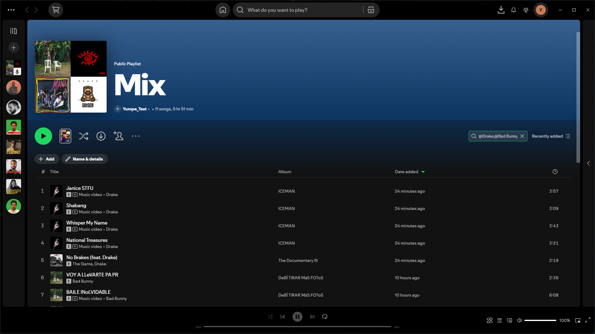

# Playlist Smart Search

A Spicetify extension that improves searching inside Spotify playlists with smarter filtering, advanced query syntax, and integrated filtered playback.



## Features

- Search inside Spotify playlists using the existing playlist search interface
- Filter by track title, artist, album, and release year
- Combine multiple search conditions
- Search for multiple artists
- Match exact artists
- Exclude unwanted terms
- Filter by specific years, year ranges, or comparisons
- Play the filtered results directly
- Designed to work well with large playlists
- Optional compact/collapsed results view
- Built-in advanced syntax help
- Local-only configuration with no telemetry or remote logging

## Installation

### Spicetify Marketplace

Playlist Smart Search can be installed directly from the Spicetify Marketplace.

### Manual installation

1. Download `smart-search.js`.
2. Copy it to your Spicetify Extensions folder:

```text
%APPDATA%\spicetify\Extensions\
```

3. Run:

```powershell
spicetify config extensions smart-search.js
spicetify apply
```

## Usage

Open any Spotify playlist and use the playlist's search field normally.

For a simple search, just type what you are looking for:

```text
Mora
```

Smart Search also supports advanced filters and operators.

### Search by field

```text
artist:Mora
title:Memorias
album:Microdosis
year:2022
```

`track:` can also be used as an alias for `title:`.

### Exact artist

Prefix an artist with `@` to match that artist exactly:

```text
@Mora
```

You can also use:

```text
artist:@Mora
```

### Either artist

Use `;` to search for either artist:

```text
Quevedo;Mora
```

### Multiple credited artists

Use `&` when all conditions must match:

```text
@Quevedo & @Mora
```

You can also combine different filters:

```text
artist:Mora & year:>=2022
```

### Exclude a term

Prefix a term with `-`:

```text
-live
```

For example:

```text
artist:Mora & -live
```

### Year filters

Search for one year:

```text
year:2022
```

Search a range:

```text
year:2018-2022
```

Or use comparisons:

```text
year:>2020
year:>=2020
year:<2020
year:<=2020
```

### Quotes

Quotes can be used when a value contains spaces:

```text
artist:"Bad Bunny"
album:"Un Verano Sin Ti"
```

## Settings

Open:

**Spotify profile picture → Smart Search settings**

Available settings include:

- **Enabled** — enable or disable Smart Search on playlist pages
- **Collapse results by default** — keep the filtered result list compact
- **Show syntax help** — show a small advanced-search reminder below the results

The Settings window also contains links for reporting bugs, suggesting features, and viewing the project on GitHub.

## Filtered playback

Smart Search can play the filtered set of tracks rather than the complete playlist.

This lets you search for a subset of a playlist and continue listening within those filtered results.

## Privacy

Playlist Smart Search does not include telemetry or remote logging.

Its configuration is stored locally on your device.

## Contributing

Bug reports and feature suggestions are very welcome through GitHub Issues.

To keep the project manageable, code contributions are currently limited to collaborators. If you have an improvement in mind, please open a feature request and describe your idea there.

## Feedback and support

Found a problem or have an idea?

- [Report a bug](https://github.com/Yumppe/spicetify-playlist-smart-search/issues/new?template=bug_report.md)
- [Suggest a feature](https://github.com/Yumppe/spicetify-playlist-smart-search/issues/new?template=feature_request.md)
- [View all issues](https://github.com/Yumppe/spicetify-playlist-smart-search/issues)

## Disclaimer

This project is not affiliated with Spotify or Spicetify.
