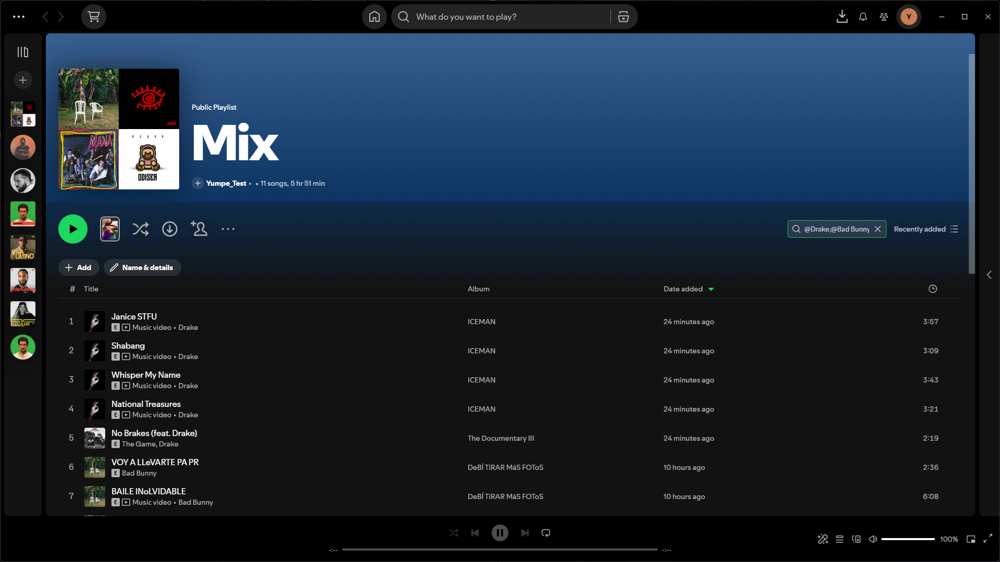

# Playlist Smart Search

A Spicetify extension that makes searching inside Spotify playlists more useful with compact filters, exact-artist matching, and playback limited to the filtered results.



## Features

- Keeps Spotify's normal playlist search for plain text
- Adds compact advanced syntax for AND, OR, exclusions, exact artists, and release years
- Supports exact artist matching with `@`
- Supports single years, ranges, and year comparisons
- Shows syntax hints and artist suggestions while typing advanced searches
- Uses its own result list for advanced searches, avoiding conflicts with Spotify's virtualized playlist rows
- Follows Spotify's current playlist sort order
- Plays only the filtered results and follows Spotify's Shuffle setting
- Preserves songs you manually add to the queue
- Detects playlist changes and refreshes cached data
- Includes a diagnostics panel for troubleshooting
- Stores settings locally; no telemetry or remote logging

## Installation

### Spicetify Marketplace

Playlist Smart Search can be installed directly from the Spicetify Marketplace.

### Manual installation

1. Download `smart-search.js`.
2. Copy it to your Spicetify Extensions folder:

```text
%APPDATA%\spicetify\Extensions\
```

3. Run:

```powershell
spicetify config extensions smart-search.js
spicetify apply
```

## Usage

Open a Spotify playlist and use the playlist search field as usual.

Plain text stays with Spotify's built-in search:

```text
Mora
```

Smart Search takes over when the query contains advanced syntax.

### Exact artist

Prefix an artist with `@`:

```text
@Mora
```

This matches Mora as an artist credit instead of treating the name as general text.

### OR

Use `;` when either side can match:

```text
@Quevedo;@Mora
```

You can also use normal text:

```text
Quevedo;Mora
```

### AND

Use `&` when every condition must match:

```text
@Quevedo & @Mora
```

For example, to keep Mora tracks but remove live versions:

```text
@Mora & -live
```

### Exclude a term

Prefix a term with `-`:

```text
-live
```

### Year filters

One year:

```text
year:2022
```

A range:

```text
year:2018-2022
```

Comparisons:

```text
year:>2020
year:>=2020
year:<2020
year:<=2020
```

Year comparisons can also be written in compact form:

```text
>2017 & <2020
```

### Escaping special characters

Use `\` when you want a reserved character to be treated as normal text:

```text
rock\&roll
```

The reserved characters are `;`, `&`, `@`, `-`, and `\`.

If you used the older 1.0 field syntax such as `artist:` or `title:`, see [MIGRATION-1.0-to-1.1.md](MIGRATION-1.0-to-1.1.md).

## Settings

Open:

**Spotify profile picture → Smart Search settings**

Available settings include:

- **Enabled** — enable or disable Smart Search on playlist pages
- **Live playlist refresh** — update Smart Search after tracks are added or removed
- **Collapse results by default** — start with the Smart Search result list collapsed
- **Show syntax help** — show contextual syntax hints and artist suggestions below the playlist search field

The Settings window also includes diagnostics, a manual playlist refresh action, release notes, and links for bug reports and feature requests.

## Filtered playback

When an advanced search is active, Smart Search plays from the filtered result set instead of handing playback back to the full playlist.

With Shuffle off, clicking a result starts that track and continues in the current visible Smart Search order. With Shuffle on, the clicked track still starts first and the remaining filtered tracks are randomized. Repeat All wraps through the filtered set, and manually queued songs keep their normal priority.

Some Spotify builds can briefly show Spotify's generic **"can't play this right now"** notification during the filtered-playback handoff even though the selected track starts correctly. Smart Search does not hide Spotify's global playback errors because that could also hide a real error.

## Development

The development source lives in `src/`, with tests in `tests/`. The Marketplace/manual-install file is the bundled `smart-search.js` at the repository root.

```bash
npm install
npm test
npm run build
```

`npm run build` writes the generated bundle to:

```text
dist/smart-search.js
```

The main source areas are:

```text
src/
  search/    query parsing and matching
  spotify/   playlist data, sorting, queue and playback integration
  ui/        result list, settings, syntax help and styles
```

For a more detailed overview, see [ARCHITECTURE.md](ARCHITECTURE.md). Full 1.1 changes are listed in [CHANGELOG.md](CHANGELOG.md).

## Privacy

Playlist Smart Search does not include telemetry or remote logging. Settings and release-note state are stored locally on your device.

## Contributing

Bug reports and feature suggestions are welcome through GitHub Issues.

To keep the project manageable, code contributions are currently limited to collaborators. If you have an improvement in mind, please open a feature request and describe it there.

## Feedback and support

Found a problem or have an idea?

- [Report a bug](https://github.com/Yumppe/spicetify-playlist-smart-search/issues/new?template=bug_report.md)
- [Suggest a feature](https://github.com/Yumppe/spicetify-playlist-smart-search/issues/new?template=feature_request.md)
- [View all issues](https://github.com/Yumppe/spicetify-playlist-smart-search/issues)

## Disclaimer

This project is not affiliated with Spotify or Spicetify.
